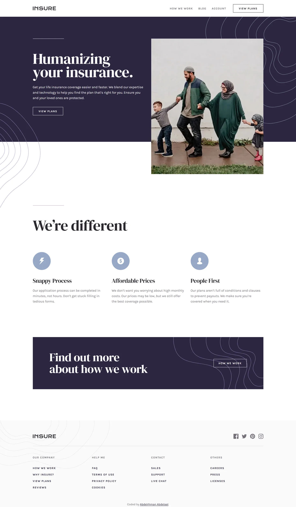

# Frontend Mentor - Insure landing page solution

This is a solution to the [Insure landing page challenge on Frontend Mentor](https://www.frontendmentor.io/challenges/insure-landing-page-uTU68JV8). Frontend Mentor challenges help you improve your coding skills by building realistic projects.

## Table of contents

- [Overview](#overview)
  - [Screenshot](#screenshot)
  - [Links](#links)
- [My process](#my-process)
  - [Built with](#built-with)
  - [Design deviations](#design-deviations)
- [Author](#author)

## Overview

### Screenshot

### Links

- Solution URL: [GitHub](https://github.com/MrBlackvanta/insure-landing-page)
- Live Site URL: [Cloudflare](https://insure-landing-page.abdelrhman-ahmed8881.workers.dev)

## My process

### Built with

- [Next.js 16](https://nextjs.org/) (App Router, React Compiler, Turbopack)
- [React 19](https://react.dev/)
- [TypeScript](https://www.typescriptlang.org/) (strict)
- [Tailwind CSS v4](https://tailwindcss.com/)

### Design deviations

**One colour changes, to reach 100 on Lighthouse accessibility.** Dark Grayish Violet
carries the nav links, all three feature paragraphs, the footer column headings and the
social icons. It fails AA as body text on both backdrops it sits on, so it darkens by 4.7
lightness points. Every ratio below is measured from the production build against the
backdrop the text actually sits on.

|                                          | design    | contrast                   | shipped   | contrast    |
| ---------------------------------------- | --------- | -------------------------- | --------- | ----------- |
| Nav links, feature copy, footer headings | `#837D88` | 4.00 white, 3.83 `#FAFAFA` | `#77717C` | 4.73 / 4.53 |

`#77717C` is the lightest value that clears 4.5:1 on _both_ backdrops when solved against
the rounded 8-bit channels the browser actually paints — `46.6%` lightness fails `#FAFAFA`
at 4.49. The footer's off-white, not white, is what governs the value. The social icons
would have passed as-designed (3.83 clears the 3:1 bar for UI graphics) but keep the single
token: they sit fifty pixels from the column headings, and two greys that close together
would read as a mistake rather than a decision.

**Nothing else moves.** The decorative pieces fail WCAG on paper and ship exactly as drawn,
because none of them carry information: the 86px feature icons (2.39:1, with the `<h3>`
beneath each one carrying the meaning), the mauve rule above "We're different" (2.47:1), the
footer divider (1.34:1) and the curve patterns (1.22:1). Where a curve crosses white text —
behind the CTA button, behind the footer headings — it is a 1px hairline, not a background;
repainting the palette so white cleared 4.5:1 against `#9E96C6` would mean losing the curves
altogether, which is a far larger loss than the theoretical one it fixes.

**Four of the five style-guide colours are rounded** and land one part in 255 from the real
paint, so the palette uses the values in the design file: Dark Violet is `#2D2641` not
`#2D2640`, Grayish Blue `#96A9C6` not `#95A9C6`, Very Dark Violet `#2C2830` not `#2B272F`,
Dark Grayish Violet `#837D88` not `#837D87`. Only Very Light Gray was already exact.

**The design also uses four colours the style guide never lists:** `#C396C6` for the rule
above "We're different" (the hero's matching rule is white), `#DADADA` for the footer
divider, and `#9E96C6` and `#E4E4E4` for the curve patterns' strokes.

**Five places where the design disagrees with itself, and what I did:**

- The desktop header logo sits at `x=168` while every other element in that row aligns to
  the 165px content edge. It ships at 165.
- The desktop header centres the logo perfectly in the 80px bar but nudges the CTA button
  and the nav labels about 1px below centre. Everything is centred.
- The two desktop nav gaps are 25px and 26px. One gap cannot be both; 26px ships, which
  costs 1px of leftward drift on a right-aligned row.
- The CTA box has 81px of padding on the left and 80px on the right. Both are 80.
- The desktop footer's _Our company_ column reads VIEW PLANS where the mobile frame reads
  CHECK PRICE. VIEW PLANS ships at both, matching the header CTA.

**The footer is about 22px taller than the mock** (42px on mobile, where it wraps to two
lines) because it carries the attribution line, which the mock has no room for.

**The hero photograph is not the one supplied with the challenge.** It is a different
photograph in the same crop and aspect ratio, so the layout is unaffected, but the hero will
not pixel-match the design JPGs.

## Author

- UpWork - [Abdelrhman Abdelaal](https://www.upwork.com/freelancers/mrblackvanta)
- Frontend Mentor - [@MrBlackvanta](https://www.frontendmentor.io/profile/MrBlackvanta)
- LinkedIn - [Abdelrhman Abdelaal](https://www.linkedin.com/in/abdelrhman-vanta/)
